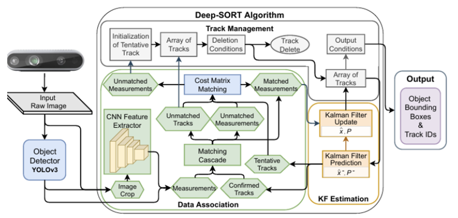
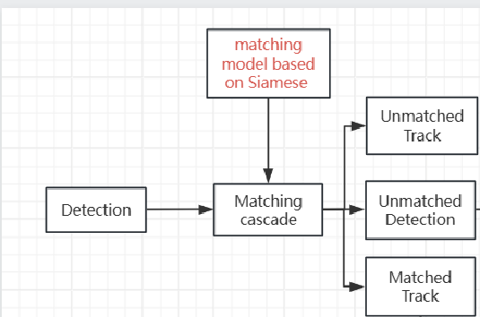

# Deep SORT (Changing the matching method)

## Introduction

This repository contains code for *Simple Online and Realtime Tracking with a Deep Association Metric* (Deep SORT).
We extend the original [SORT](https://github.com/abewley/sort) algorithm to
integrate appearance information based on a deep appearance descriptor.
See the [arXiv preprint](https://arxiv.org/abs/1703.07402) for more information.

## Dependencies

The code is compatible with Python 2.7 and 3. The following dependencies are
needed to run the tracker:

* NumPy
* sklearn
* OpenCV
* Torch

Additionally, feature generation requires TensorFlow (>= 1.0).

## Installation

First, clone the repository:
```
git clone https://github.com/nwojke/deep_sort.git
```
Then, download pre-generated detections and the CNN checkpoint file from
[here](https://drive.google.com/open?id=18fKzfqnqhqW3s9zwsCbnVJ5XF2JFeqMp).

*NOTE:* The candidate object locations of our pre-generated detections are
taken from the following paper:
```
F. Yu, W. Li, Q. Li, Y. Liu, X. Shi, J. Yan. POI: Multiple Object Tracking with
High Performance Detection and Appearance Feature. In BMTT, SenseTime Group
Limited, 2016.
```
We have replaced the appearance descriptor with a custom deep convolutional
neural network (see below).

## Running the tracker

The following example starts the tracker on one of the
[MOT16 benchmark](https://motchallenge.net/data/MOT16/)
sequences.
We assume resources have been extracted to the repository root directory and
the MOT16 benchmark data is in `./MOT16`:
```
python deep_sort_app.py \
    --sequence_dir=./MOT16/test/MOT16-06 \
    --detection_file=./resources/detections/MOT16_POI_test/MOT16-06.npy \
    --min_confidence=0.3 \
    --nn_budget=100 \
    --display=True
```
Check `python deep_sort_app.py -h` for an overview of available options.
There are also scripts in the repository to visualize results, generate videos,
and evaluate the MOT challenge benchmark.

## Generating detections

Beside the main tracking application, this repository contains a script to
generate features for person re-identification, suitable to compare the visual
appearance of pedestrian bounding boxes using cosine similarity.
The following example generates these features from standard MOT challenge
detections. Again, we assume resources have been extracted to the repository
root directory and MOT16 data is in `./MOT16`:
```
python tools/generate_detections.py \
    --model=resources/networks/mars-small128.pb \
    --mot_dir=./MOT16/train \
    --output_dir=./resources/detections/MOT16_train
```
The model has been generated with TensorFlow 1.5. If you run into
incompatibility, re-export the frozen inference graph to obtain a new
`mars-small128.pb` that is compatible with your version:
```
python tools/freeze_model.py
```
The ``generate_detections.py`` stores for each sequence of the MOT16 dataset
a separate binary file in NumPy native format. Each file contains an array of
shape `Nx138`, where N is the number of detections in the corresponding MOT
sequence. The first 10 columns of this array contain the raw MOT detection
copied over from the input file. The remaining 128 columns store the appearance
descriptor. The files generated by this command can be used as input for the
`deep_sort_app.py`.

**NOTE**: If ``python tools/generate_detections.py`` raises a TensorFlow error,
try passing an absolute path to the ``--model`` argument. This might help in
some cases.

## The overall process of original deepsort
The figure below is the basic matching process of deepsort

 

### The main improvement of deepsort
I have replaced the original DeepSORT matching method with a Siamese network to improve the performance of object tracking. The Siamese network enhances tracking accuracy and robustness by learning to compare and match object features more effectively, enabling better discrimination between similar objects across frames. This modification allows for more reliable tracking in complex scenarios with occlusions or appearance changes.


 

The main method of how we train and integrate the siamese to the original deepsort is shown in file below:
* trainer.py
* mydeepsort.py


