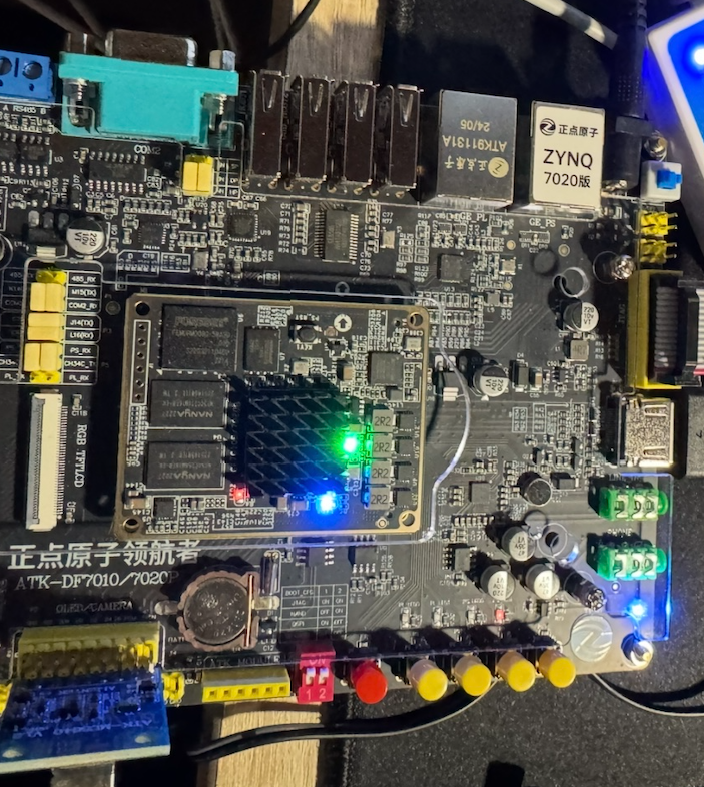
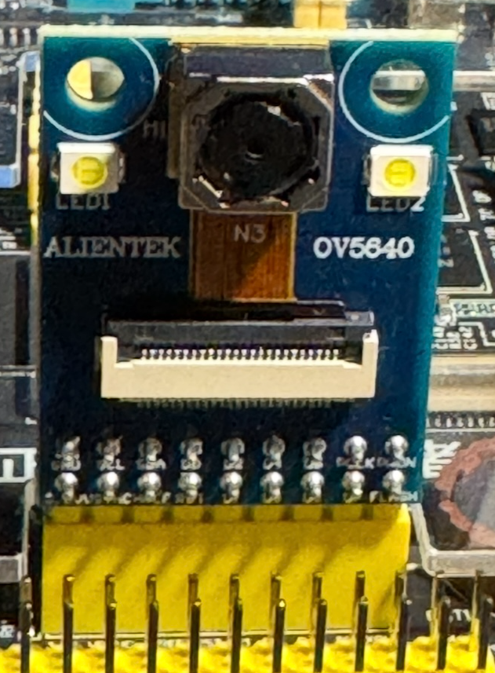
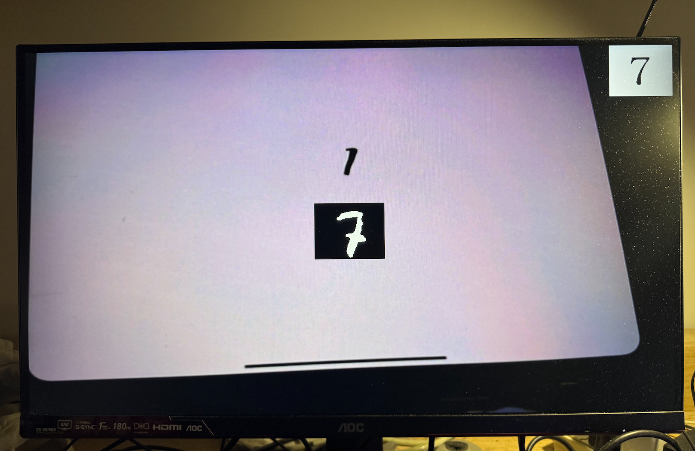
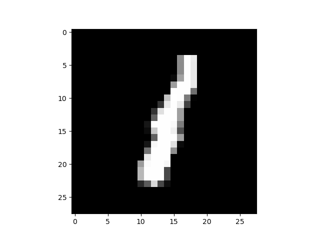
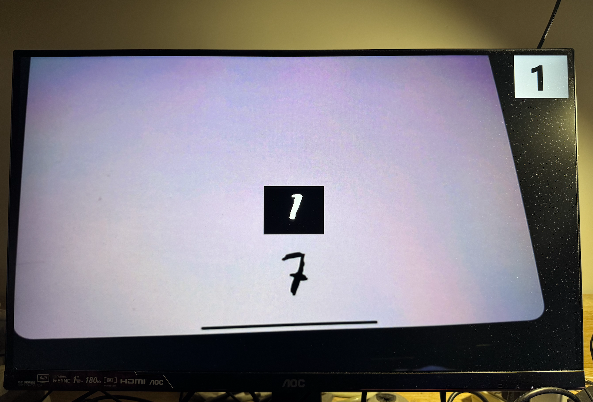

# Handwritten Digit Recognition System Based on ZYNQ-7020 and CNN

This project has realized a complete low-power embedded handwritten digit recognition system, based on the ZYNQ-7020 SoC platform. It integrates key functions such as camera image acquisition (OV5640), convolutional neural network (CNN) classification, and HDMI image display. The system works collaboratively through hardware logic (Vivado) and embedded software (Vitis), supporting real-time recognition of digits from 0 to 9.

---

<table>
  <tr>
    <td>
      
    </td>
    <td>
      
    </td>
    <td>
      
    </td>
  </tr>
</table>

## Project Profile
- **Project Name**: Code_ZYNQ_CNN
- **Platform**: ZYNQ-7020
- **Core Algorithm**: Convolutional Neural Network (CNN)
- **Main Functions**:
  - Camera image capture (28×28)
  - CNN model inference
  - Recognition result output via HDMI

---

## CNN Network Structure 
| Level         | Type           | Output Dimension | Description                   |
|--------------|-------------  |---------------- |------------------------------|
| Layer 1       | Input Layer    | 28×28          | Gray-scale handwritten image input |
| Layer 2      | Convolution Layer | 24×24×30     | 30 5×5 convolution kernels        |
| Layer 3      | Pooling Layer   | 12×12×30       | 2×2 maximum pooling           |
| Layer 4      | Fully Connected Layer | 100 nodes    | Uses ReLU activation           |
| Layer 5      | Output Layer   | 10 categories  | Softmax output, selects the maximum probability | 

---

## Project Directory Structure Explanation 
```bash
Code_ZYNQ_CNN/
├── coe/                          # System COE configuration file
├── ip_repo/                      # Custom IP storage directory
├── pin.xdc                       # Constraint file, containing pin binding information
├── project_1.ip_user_files/      # Automatically generated IP user files by Vivado
├── project_1.runs/               # Output from Vivado synthesis and implementation
├── project_1.sim/                # Simulation-related files
├── project_1.srcs/               # Source code (Verilog HDL) directory
├── project_1.xpr                 # Main file of Vivado project
├── vitis/                        # Vitis embedded project (C language for CNN)
```

## Technical Details of System Implementation 

### Hardware Section (Vivado) 
- **Image Interface**: Captures image data through the OV5640 camera module  
- **Display Interface**: Presents the recognized results in graphical form using the HDMI module  
- **Communication Interface**: PL side handles the input of data streams and intermediate storage  
- **Clock Control**: Controls the CNN operation process based on the FPGA clock domain 

### Embedded Software Section (Vitis) 
- **The CNN model runs on the ARM Cortex-A9 core (on the PS side)**  
- **The forward reasoning logic of the CNN is deployed using C language**  
- **The weights are derived from the trained model (trained in Python and manually imported)**  
- **Online debugging and deployment are carried out using the JTAG mode** 

---

## Project Test Results 
- Real-time recognition of handwritten digits from 0 to 9, with high accuracy and low latency  
- Results can be displayed in real time via HDMI, without the need for an external computer  
- Inter-module coordination is stable, and the overall system power consumption is low, making it suitable for embedded scenarios

---

<table>
  <tr>
    <td>
      
    </td>
    <td>
      
    </td>
  </tr>
</table>

## How to Run This Project 
1. Open **Vivado**, load `project_1.xpr` and generate the bitstream file.
2. Open **Vitis**, load the `vitis_11111` project and compile the configuration.
3. Use the **JTAG** mode to download the project to the ZYNQ-7020 board.
4. Connect the **OV5640 camera** and the **HDMI display**, power on and run. 
---

## Environmental Dependency 
- Vivado 2019.2 
- Vitis 2029.2
- Python (used for training CNN models)  
- ZYNQ-7020 board + OV5640 camera module + HDMI display module 
---

## Follow-up Work 
- Add support for model compression and quantization to enhance inference speed  
- Enhance the system's generalization ability for different handwritten fonts  
- Explore the use of SNN (Spiking Neural Network) instead of CNN to further reduce power consumption 
---

##  License

This project adopts the **MIT License**, which encourages its use for teaching, research and secondary development.


